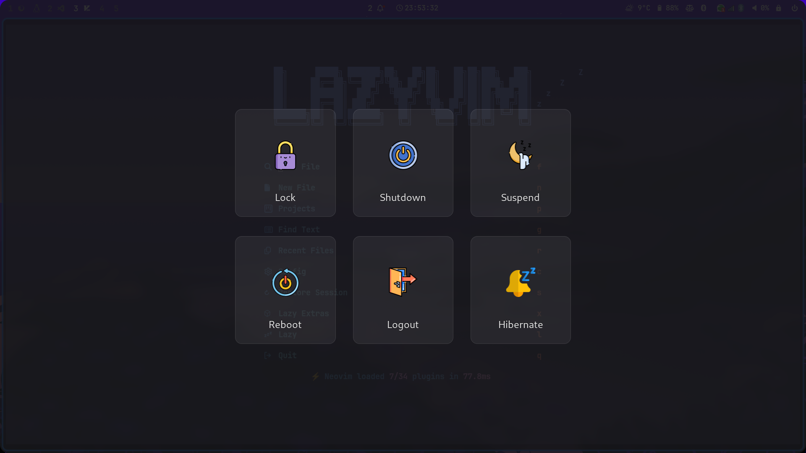

# Hyprland Dotfiles

This repository contains my personal configuration files for the **Hyprland** Wayland compositor. The setup includes custom themes for Waybar, Rofi, Kitty, and Zsh (with Powerlevel10k).

This configuration was born from the desire to create an environment that is clean, highly **functional**, and aesthetically pleasing. The choice of **Hyprland** was primarily driven by its ability to offer sophisticated graphical features, like the  **transparency (blur and opacity)**

***Crucially, the main objective behind this project was to create a configuration that could be easily and reliably recreated on another machine in case of necessity***.

The installation is designed to run successfully on a **clean base system of hyperland**

## Prerequisites

Before cloning or running the script, it is crucial that the following base packages are installed on the system.

### 1. Essential Packages (System-wide Installation)

These core programs and utilities must be installed :

| Package | Description |
| :--- | :--- |
| `hyprland` | The main Wayland Window Manager. |
| `waybar` | The custom status bar. |
| `kitty` | The terminal emulator used in the setup. |
| `rofi` | The application launcher. |
| `swww` | The wallpaper manager (for animated and static backgrounds). |
| `wlogout` | The graphical power/logout menu. |
| `swaync` | The Wayland notification center. |
| `wallust` | The wallpaper-based color scheme generator. |
| `zsh` | The advanced shell. |
| `stow` | The core tool used to manage and symlink all configuration files. |
| `git` | For cloning this repository. |
| `unzip` | Extraction utility. |
| `curl` | Necessary for installing Oh My Zsh. |
| `fzf` | Command-line fuzzy finder (for Zsh bindings). |
| `lsd` | Modern replacement for `ls` (for terminal file listings). |

### Installation

The provided `install.sh` script automates file copying, plugin installation, permission setting, and shell configuration.

> [!CAUTION]
> The script will require your user password for the final `chsh` command (Change Shell).

#### Step 1: Clone the Repository

Open a terminal and clone the repository into your Home directory:

```bash
git clone git@github.com:comitanigiacomo/dotfiles.git
```

#### Step 2: Run the Script

Navigate into the directory, and run the scrypt:

```bash
cd ~/dotfiles
chmod +x install.sh
./install.sh
```

#### Step 3: Finalization (Login)

- When prompted, enter your user password for the final `chsh` command (Change Shell).

- Once the script finishes, Log Out of your current session (hyprctl dispatch exit or similar).

- Log In again, making sure to select the Hyprland session

## Repository Structure:

This section provides an overview of the main directories that will be used by `stow` to create symlinks in your `$HOME` directory, along with an explanation of their function:

| Element | Type | Description |
| :--- | :--- | :--- |
| **`hypr`** | Directory | Contains the main configuration files for the **Hyprland** Wayland compositor (e.g., `hyprland.conf`), defining *keybinds, window layouts, and graphical effects*. |
| **`waybar`** | Directory | Configurations (CSS and JSON) for the **Waybar** (status bar), defining its *appearance, modules, and displayed information*. |
| **`rofi`** | Directory | Themes and configurations for **Rofi**, the *application launcher* and menu, customizing its look and usage modes. |
| **`kitty`** | Directory | Configuration files for the **Kitty** terminal emulator. Includes *themes, fonts, and specific terminal settings*. |
| **`zsh`** | Directory | Contains the configuration files for the **Zsh** shell (e.g., `.zshrc`) and the **Powerlevel10k** prompt settings. |
| **`swaync`** | Directory | Configuration for the **Sway Notification Center**, managing the *appearance and behavior* of system notifications. |
| **`wlogout`** | Directory | Contains the configuration files (CSS and layout) for the **wlogout** *graphical power/logout menu*. |
| **`wallust`** | Directory | Contains scripts and templates for **Wallust**, the tool that *extracts colors from the wallpaper* to apply them system-wide. |
| **`gtk-3.0`** | Directory | Configuration files for the look of **GTK3** applications (themes and settings), ensuring visual consistency. |
| **`gtk-4.0`** | Directory | Configuration files for the look of **GTK4** applications. |
| **`wallpapers`** | Directory | The image files used as backgrounds, managed by `swww`. |
| **`fonts`** | Directory | Contains custom fonts (e.g., Nerd Fonts) that are *essential for the correct display of icons and symbols* in the terminal and Waybar. |
| **`install.sh`** | Script | The **main installation script**. It automates file copying, Oh My Zsh installation, and initial configurations. |
| **`nvim`** | Directory | Configuration for **NeoVim**, the text editor (if included in your setup). |




### Credits 

This configuration is heavily inspired by and uses structure elements from [JaKooLit's Hyprland dotfiles](https://github.com/JaKooLit/Hyprland-Dots), which served as an excellent functional base for this project.